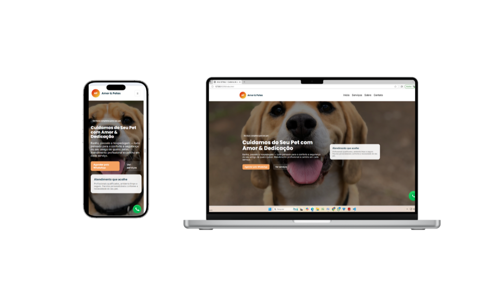

# 🐾 Amor & Patas

Landing page responsiva desenvolvida para um negócio fictício de serviços para pets.

O projeto foi criado com o objetivo de praticar desenvolvimento front-end, estruturação de páginas, responsividade e interações utilizando JavaScript.

A página apresenta uma identidade visual voltada para o público pet e reúne informações sobre serviços, depoimentos, localização e formas de contato.

---

## 📸 Preview



---

## ✨ Funcionalidades

- Navegação entre as principais seções da página
- Menu responsivo para dispositivos móveis
- Seção de apresentação dos serviços
- Carrossel interativo de depoimentos
- Formulário de contato
- Botões de contato direcionados ao WhatsApp
- Seção de localização com mapa integrado
- Links para redes sociais
- Layout adaptado para desktop, tablet e smartphone
- Rolagem suave entre as seções da página

---

## 🛠️ Tecnologias utilizadas


---

## 📱 Responsividade

O projeto foi desenvolvido pensando em diferentes tamanhos de tela.

Foram realizados testes em:

- 💻 Desktop
- 📱 Smartphone
- 📲 Tablet

O layout utiliza CSS e Media Queries para adaptar a estrutura, espaçamentos, tipografia, navegação e componentes de acordo com o tamanho da tela.

---

## 📚 Principais conceitos praticados

Durante o desenvolvimento deste projeto foram praticados conceitos como:

- Estrutura semântica com HTML5
- Organização e estilização com CSS3
- Media Queries
- Design responsivo
- Manipulação do DOM
- Eventos em JavaScript
- Navegação por âncoras
- Criação de carrossel
- Manipulação de formulários
- Integração de links com WhatsApp
- Organização de arquivos em um projeto front-end
- Versionamento utilizando Git e GitHub

---
## 🚀 Como executar o projeto

### 1. Clone o repositório

```bash
git clone https://github.com/mirelesantossilva-468/Projeto-Amor-Patas.git
```

### 2. Acesse a pasta

```bash
cd Projeto-Amor-Patas
```

### 3. Execute o projeto

Abra o arquivo `index.html` no navegador.

Também é possível utilizar uma extensão como o **Live Server** no VS Code.

---

## 🔗 Repositório

[GitHub - Projeto Amor & Patas](https://github.com/mirelesantossilva-468/Projeto-Amor-Patas)

---

## 👩‍💻 Autora

**Mirele Santos**

Estudante de Engenharia de Software, com foco em desenvolvimento front-end e em constante evolução na área de tecnologia.

[](https://github.com/mirelesantossilva-468)

---

⭐ Projeto desenvolvido como parte da minha jornada de aprendizado em desenvolvimento web.